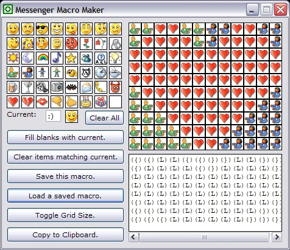



## MSN Messenger Emoticon Macro Maker \(v3\)

### Description

Simple program in nature. This program will allow you to build emoticon picture macros. I am sure many of you have seen them when chatting. It is when a person uses a bunch of emoticons to build a bigger picture. Like the word "Hello" spelled out with smile faces. Take a look at the screen shot for a clearer understanding. Anyhow, this is my third post of this (I have removed the other posts of it to help clean PSC clean from older versions of the same software [wish others would do the same sometimes but I am getting off on a tangent]). The latest update now gives you a WYSIWYG (what you see is what you get) feel. A person asked form that in my last post. This version will still read the older macro files the other versions generated if you did find yourself using my last version. Next step (if I find the time) is to make it a real MSN Messenger Add-In. Hope you all like it.
 
### More Info
 

             |
---                |---
**Submitted On**   |2003-04-17 12:18:54
**By**             |[Chloe](https://github.com/Planet-Source-Code/PSCIndex/blob/master/ByAuthor/chloe.md)
**Level**          |Beginner
**User Rating**    |5.0 (45 globes from 9 users)
**Compatibility**  |VB 6\.0
**Category**       |[Complete Applications](https://github.com/Planet-Source-Code/PSCIndex/blob/master/ByCategory/complete-applications__1-27.md)
**World**          |[Visual Basic](https://github.com/Planet-Source-Code/PSCIndex/blob/master/ByWorld/visual-basic.md)
**Archive File**   |[MSN\_Messen1575164172003\.zip](https://github.com/Planet-Source-Code/chloe-msn-messenger-emoticon-macro-maker-v3__1-44812/archive/master.zip)

